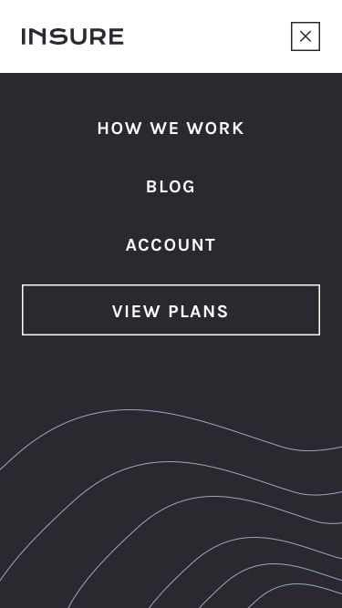

<h1>O desafio</h1>

Proposta feita nesse desafio pelo Frontend Mentor era desenvolver uma página inicial testando a capacidade de criar menus de navegação suspensos; um padrão comum em sites maiores. Esse foi meu segundo desafio de nivél júnior.  
Segundo desafio dessa site era buscar uma versão mobile bem defina.

 O link do desafio:https://www.frontendmentor.io/challenges/insure-landing-page-uTU68JV8/hub

 Imagens para nortea-lo ao desenvolvimento do desafio. 

 Página inicial. 
 

 Página Responsiva.  
 

 Menu Collapse.  
 

